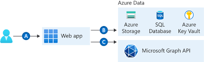

### ### MICROSOFT-CERTIFIED : Principes de base de Microsoft Azure

## Objectifs d’apprentissage

À l’issue de ce module, je pourrais :

- Définir le cloud computing.
- Décrire le modèle de responsabilité partagée.
- Définir les modèles de cloud, notamment public, privé et hybride.
- Identifier les cas d’usage appropriés pour chaque modèle de cloud.
- Décrire le modèle basé sur la consommation.
- Comparer les modèles tarifaires liés au cloud.

1.  Introduction aux fondamentaux de Microsoft Azure

Microsoft Azure est une plateforme Cloud computing offrant un ensemble croissant de services permettant d'aider les commerciaux dans la quête d'une solution efficace répondant à leurs objectifs.

Les services cloud d'Azure prennent en charge tous les aspects au plus simples au plus complexes, Azure propose un service web simple pour héberger les services commerciaux des entreprises dans le cloud.
Il s'occupe de la gestion sur des machines virtuelles personnalisées que ce soit pour :

* Le stockage distant
* Héberger les BDD
* La gestion centralisée  des comptes
* Services de l'IA et IoT (Internet des Objets)*

Les fondamentaux d'Azure sont basés sur une série de 3 parcours d'apprentissage qui permettront de se familiariser avec Azure et ses multitudes de fonctionnalités.

[Que vous soyez intéressé par les services de calcul, de réseau ou de stockage, découvrir les meilleures pratiques de sécurité Cloud, l’exploration des options de gouvernance et de gestion, considérez les Fondamentaux Azure comme votre guide personnalisé pour Azure.]

Azure offre un environnement portail temporaire appelé "BAC A SABLE", permettant de créer des ressources Cloud gratuitement.
Ce dernier ne demande pas une maitrise absolue en informatique mais le cas contraire pourrait être plus intéressant pour une vision globale et approfondie d'Azure Cloud Service.

Ce module permet de comprendre trois grands catégories très importantes pour l'apprentissage et à la certification :

##### Description des concepts du Cloud (25-30%)
##### Décrire l'architecture et le service Azure (35-40%)
##### Décrire le gestion et la gouvernance d'Azure (30-35%)

## QU'EST-CE QUE LE CLOUD COMPUTING ?

Le cloud permet de fournir les services informatiques sur internet. Ces services peuvent être l'infrastructure informatique telles que les machines virtuelles, le stockage, les bases de données et le réseau.

Les services cloud sont répandu sur d'autres offres informatiques classique tels que l'IoT, ML et l'IA.

![[Pasted image 20231129145332.png]]

## Définir les modèles du Cloud
Il existe trois principaux modèles du cloud, ils définissent le type de déploiement des ressources cloud.
## Cloud privé

Commençons par le cloud privé. Un cloud privé est, à certains égards, l’évolution naturelle d’un centre de données d’entreprise. Il s’agit d’un cloud (fournissant des services informatiques sur Internet) qui est utilisé par une seule entité. Le cloud privé offre un contrôle beaucoup plus important à l’entreprise et à son service informatique. Toutefois, il implique également plus de coûts et moins d’avantages par rapport à un déploiement de cloud public. Enfin, un cloud privé peut être hébergé dans votre centre de données local. Il peut également être hébergé dans un centre de données dédié hors site, notamment par un tiers qui le réserve exclusivement à votre entreprise.

## Cloud public

Un cloud public est créé, contrôlé et géré par un fournisseur de cloud tiers. Avec un cloud public, toute personne qui souhaite acheter des services cloud peut accéder aux ressources et les utiliser. La disponibilité publique générale est une différence clé entre le cloud public et le cloud privé.

## Cloud hybride

Un cloud hybride est un environnement informatique qui utilise à la fois les clouds public et privé dans un environnement interconnecté. Un environnement de cloud hybride peut permettre à un cloud privé de répondre à une demande temporaire accrue via le déploiement de ressources de cloud public. Le cloud hybride peut être utilisé pour fournir une couche de sécurité supplémentaire. Par exemple, les utilisateurs ont toute latitude pour choisir les services à conserver dans le cloud public, et ceux à déployer sur leur infrastructure de cloud privé.

Le tableau suivant met en évidence quelques aspects comparatifs clés entre les modèles de cloud.

![[Pasted image 20231129153305.png]]

## Azure VMware Solution

Que se passe-t-il si vous êtes déjà établi avec VMware dans un environnement de cloud privé, et si vous souhaitez migrer vers un cloud public ou hybride ? Azure VMware Solution vous permet d’exécuter vos charges de travail VMware dans Azure avec une intégration et une scalabilité transparentes.

## Responsabilité partagée dans le nuage
https://learn.microsoft.com/en-us/azure/security/fundamentals/media/shared-responsibility/shared-responsibility.svg
Lorsque vous considérez et évaluez les services cloud publics, il est essentiel de comprendre le modèle de responsabilité partagée et les tâches de sécurité que le fournisseur d'informatique en nuage gère et quelles tâches vous gérez. Les responsabilités en matière de charge de travail varient selon que la charge de travail est hébergée sur le logiciel en tant que service (SaaS), la plate-forme en tant que service (PaaS), l'infrastructure en tant que service (IaaS) ou dans un centre de données sur site.

# Décrire le modèle basé sur la consommation

## IMPORTANT....!!!

****************************************************************************************************************
"L’élasticité fait référence à la possibilité de mettre à l’échelle les ressources en fonction des besoins, par exemple pendant les heures ouvrées, pour garantir qu’une application peut satisfaire la demande, puis de réduire les ressources disponibles pendant les heures creuses. L’agilité fait référence à la possibilité de déployer rapidement de nouvelles applications et de nouveaux services. La haute disponibilité fait référence à la possibilité de garantir qu’un service ou une application reste disponible en cas de défaillance. La géodistribution permet de rendre un service ou une application disponible dans plusieurs emplacements géographiques qui sont généralement proches de vos utilisateurs.

https://www.ovhcloud.com/fr/public-cloud/what-cloud-service/"

Machines Virtuelles Azure est une offre IaaS. Le client est responsable de la configuration de la machine virtuelle ainsi que de toutes les configurations du système d’exploitation. Azure App Services et Azure Cosmos DB sont des offres PaaS. Microsoft Office 365 est une offre SaaS.

### Décrire la gestion des coûts dans Azure

Les compteurs d’utilisation, comme le temps processeur, la taille du disque et les opérations d’écriture, sont utilisés pour calculer votre facture pour une ressource Azure. La suppression ou la désallocation d’une ressource signifie que vous ne serez plus facturé pour celle-ci. Les prix peuvent varier en fonction de la région. Les ressources coûtent le même prix, indépendamment de l’heure de la journée ou du jour de la semaine.

La calculatrice de prix Azure vous permet d’estimer et de configurer en fonction de vos besoins spécifiques. Vous allez recevoir ensuite une estimation du prix global ainsi que le détail des coûts associés à chaque ressource ajoutée à votre solution.

### Décrire les fonctionnalités et outils d'Azure pour la gouvernance et la conformité

Azure Policy est un service Azure qui vous permet de créer, affecter et gérer des stratégies qui contrôlent ou auditent des ressources. Ces stratégies appliquent différentes règles à toutes les configurations des ressources pour que celles-ci restent conformes aux standards de l’entreprise.

Les stratégies Azure vous permettent d’appliquer des standards d’entreprise sur de nouvelles machines virtuelles quand elles sont combinées avec Azure VM Image Builder et Azure Compute Gallery. Grâce à Azure Policy et aux affectations avec contrôle d’accès en fonction du rôle (RBAC), les entreprises peuvent appliquer des standards aux ressources Azure. Cependant, sur les machines virtuelles, ces mécanismes affectent seulement le plan de contrôle ou la route vers la machine virtuelle.

Azure Policy est un service Azure qui vous permet de créer, affecter et gérer des stratégies qui contrôlent ou auditent des ressources.

Azure Policy vous permet de définir à la fois des stratégies individuelles et des groupes de stratégies associées, appelées « initiatives ». Azure Policy évalue vos ressources et met en évidence celles qui ne sont pas conformes aux stratégies que vous avez créées. Azure Policy vous permet également d’empêcher la création de ressources non conformes.

Les "avis d’intégrité" sont des problèmes qui vous obligent à agir de façon proactive pour éviter une interruption du service, comme les services abandonnés et les changements cassants. Les problèmes de service sont des problèmes comme des pannes qui nécessitent des actions immédiates.

Application Insights est une fonctionnalité d’Azure Monitor qui vous permet de superviser les applications en cours d’exécution, de détecter automatiquement les anomalies dans les performances et d’utiliser des outils d’analytique intégrés pour voir ce que font les utilisateurs sur une application.

Service Health vous informe des problèmes de service liés à Azure, comme les temps d’arrêt à l’échelle d’une région.

Incorrect : Une identité managée affectée par l’utilisateur - Ajouter une identité ne va pas ajouter la possibilité de modifier ou de supprimer la ressource.

Utilisation correcte : Un verrou - Un verrou de ressource va satisfaire aux deux exigences.

Incorrect : Une étiquette - Une étiquette ne va pas satisfaire aux exigences.

Incorrect : Accès conditionnel - L’accès conditionnel ne va pas satisfaire aux exigences.

Protéger vos ressources Azure avec un verrou - Azure Resource Manager | Microsoft Docs

Décrire les fonctionnalités et les outils d’Azure pour la gouvernance et la conformité - Formation | Microsoft Learn

Chaque région Azure est toujours appairée à une autre région au sein de la même zone géographique (par exemple États-Unis, Europe ou Asie) à au moins 482 kilomètres de distance.
***************************************************************************************************************
Lorsqu'on compare les modèles d'infrastructure informatique, il y a deux types de dépenses à considérer. Dépenses d’investissement ("CapEx") et dépenses d’exploitation ("OpEx").

Les CapEx sont généralement des dépenses uniques et initiales pour l’achat ou la sécurisation de ressources tangibles. L'achat d'un nouveau bâtiment, le repavage du parking, la construction d'un centre de données ou l'achat d'un véhicule d'entreprise sont des exemples de CapEx.

En revanche, l'OpEx consiste à dépenser de l'argent sur des services ou des produits au fil du temps. La location d’un centre de conventions, le crédit-bail d’un véhicule de société ou l’abonnement à des services cloud sont autant d’exemples d’OpEx.

Le cloud computing relève des OpEx, car il fonctionne selon un modèle basé sur la consommation. Avec le cloud computing, vous ne payez pas pour l’infrastructure physique, l’électricité, la sécurité ou tout ce qui est associé à la maintenance d’un centre de données. À la place, vous payez pour les ressources informatiques que vous utilisez. Si vous n’utilisez aucune ressource informatique ce mois-ci, vous ne payez pas pour ces dernières.

Ce modèle basé sur la consommation présente de nombreux avantages, notamment :

- Pas de frais initiaux.
- Nul besoin d’acheter et de gérer une infrastructure coûteuse que les utilisateurs n’exploitent pas toujours au maximum.
- Possibilité de payer pour des ressources supplémentaires quand elles sont nécessaires.
- Possibilité de cesser de payer pour les ressources qui ne sont plus nécessaires.

Avec un centre de données classique, vous essayez d’estimer les besoins futurs en ressources. En cas de surestimation de vos calculs, vous dépensez plus que nécessaire pour votre centre de données, et vous risquez de perdre de l’argent. En cas de sous-estimation de vos calculs, votre centre de données atteindra rapidement sa capacité maximale, et vos applications et services risquent de souffrir d’une baisse de performances. La correction d’un centre de données sous-dimensionné peut prendre beaucoup de temps. Vous devrez peut-être commander, recevoir et installer davantage de matériel. Vous devrez également ajouter de l'alimentation électrique, de la climatisation et des connexions réseau pour le matériel supplémentaire.

Dans un modèle basé sur le cloud, vous n’avez pas à vous soucier de l’obtention des ressources nécessaires. Si vous constatez que vous avez besoin de plus de machines virtuelles, ajoutez-en. Si la demande diminue et si vous n’avez pas besoin d’autant de machines virtuelles, supprimez les machines selon les besoins. Dans tous les cas, vous ne payez que pour les machines virtuelles que vous utilisez, et non pour la « capacité supplémentaire » dont dispose le fournisseur de cloud.

## Comparer les modèles de tarification Cloud

Le cloud computing consiste à fournir des services informatiques sur Internet en utilisant un modèle tarifaire de type paiement à l’utilisation. Vous payez généralement uniquement pour les services Cloud que vous utilisez, ce qui vous aide à :

- Planifier et gérer vos coûts d’exploitation.
- D’exécuter votre infrastructure plus efficacement
- Adapter la mise à l'échelle à l'évolution de vos besoins commerciaux

En d’autres termes, L'informatique en nuage est un moyen de louer de la puissance de calcul et du stockage à partir du centre de données de quelqu'un d'autre. Vous pouvez utiliser les ressources cloud de la même façon que les ressources dans votre propre centre de données. Toutefois, contrairement à votre propre centre de données, quand vous avez fini d’utiliser les ressources cloud, vous les rendez. Vous êtes facturé uniquement pour ce que vous utilisez.

Au lieu de maintenir des processeurs et des espaces de stockage dans votre centre de données, vous les louez pour la durée dont vous en avez besoin. Le fournisseur Cloud s'occupe de la maintenance de l'infrastructure sous-jacente pour vous. Le Cloud vous permet de résoudre rapidement vos défis commerciaux les plus difficiles et de proposer des solutions innovantes à vos utilisateurs.

#### Contrôle qualité des connaissances

![[Pasted image 20231129162420.png]]

![[Pasted image 20231129162457.png]]

<<<<<<< HEAD

### Décrire les avantages de la haute disponibilité et de la scalabilité dans le cloud

Durant la création ou le déploiement d’une application cloud, deux des aspects les plus importants à prendre en compte sont la durée de bon fonctionnement (ou haute disponibilité) et la capacité à gérer la demande (ou scalabilité).

####  Haute disponiblité

Lors du deploiement d'une application, il est important que les ressources soient disponibles en cas de besoin.  Cela va permettre de garantir la disponibilité des servcives peu importe les interruptions ou les événements suceptibles de se produire.

Garantir la disponibilité du service est très important pour le bon contrôle du service lié aux incidents majeurs ou mineurs.

##### SERVICE SLA (SERVIVE LEVEL AGREEMENTS)
C'est un service qui garantit la disponibilité du service selon le besoin métier:

Est-ce que le SLA de 99% est il différent du SLA de 99,9% : OUI

Tout simplement un SLA de 99% peut être indisponible jusqu'à 1.6 heures par semaine soit 7,2 heures par mois et rester disponible 99% cette durée est cumulative et peut couvrir à plusieurs incidents d'indisponibilité de service.
Tandsique le SLA de 99,9% peut être indisponible que 10 min par semaine soit 42,2 min par mois.

La différence est donc importante, si le service est indisponible pour votre activité, la différence entre plusieurs minutes et plusieurs heures de temps d'arrêt sera considérable.

En général les services à haute disponibilité sont chers, chaque service Azure à son propre SLA.

#### Scalabilité

C'est la capacité à ajuster ou à traiter les requêtes par rapport à la demande ou le temps d'exécution. L'unique avantage est que l'on peut payer juster un service de scalabilté selon ces besoins.
Le cloud étant un modèle basé sur la consommation, si la demande diminue vous pouvez reduire vos ressources ainsi que le coût.

Il exite deux types de scalabilité:

* Scalabilité Horizontale
* Scalabilité Verticale

#### Scalabilité Horizontale
La scalabilité horizontale consiste à ajouter ou soustraire un certain nombre de ressources.
C'est-à-dire, si vous rencontrez soudainement une forte augmentation de la demande, vos ressources déployées peuvent faire l’objet d’un scale-out (automatiquement ou manuellement). Par exemple, vous pouvez ajouter des VMs (machines virtuelles) ou des conteneurs supplémentaires à des fins de scale-out. De la même manière, en cas de baisse significative de la demande, les ressources déployées peuvent faire l’objet d’un scale-in (automatiquement ou manuellement).

#### Scalabilité Verticale
La scalabilité verticale vise à augmenter ou diminuer les capacités des ressources.
C'est-à-dire, si vous développez une application et si vous avez besoin de plus de puissance de traitement, vous pouvez effectuer un scale-up pour ajouter davantage de processeurs ou de RAM à la machine virtuelle. À l’inverse, si vous vous rendez compte que vous avez surestimé les besoins, vous pouvez effectuer un scale-down en réduisant les spécifications du processeur ou de la RAM.

#### Décrire les avantages de la fiabilité et de la prévisibilité dans le Cloud

##### Fiabilité
La fiabilité est la capacité d’un système à reprendre son activité après une défaillance et à continuer à fonctionner. C'est également l'un des piliers du cadre Microsoft Azure Well-Architected.
vous pouvez deployer vos ressources sur l'echelle mondiale en toute fiabilité sans se souci de comment elles seront deployes.

Vous en saurez davantage sur la façon dont Azure tire parti de la mise à l’échelle au niveau à l'échelle mondiale pour garantir la fiabilité, plus loin dans cette série.

##### Prévisibilité et Performances dans le Cloud
La prévisibilité des performances et des coûts est fortement influencée par le cadre Microsoft Azure Well-Architected. Déployez une solution construite autour de ce cadre et vous avez une solution dont les coûts et les performances sont prévisibles.

La prévisibilité des performances se concentre sur la prédiction des ressources nécessaires pour offrir une expérience positive à vos clients. La autoscaling, l’équilibrage de charge et la haute disponibilité sont quelques-uns des concepts Cloud qui prennent en charge la prévisibilité des performances. Si vous avez soudainement besoin de plus de ressources, la autoscaling peut déployer des ressources supplémentaires pour répondre à la demande, puis se réduire lorsque la demande diminue. Ou, si le trafic est fortement concentré dans une zone, l'équilibrage de charge aidera à rediriger une partie de la surcharge vers des zones moins stressées" in the Performance section.

#### Décrire les avantages de la sécurité et de la gouvernance dans le Cloud
Qu’il s’agisse d’un déploiement de type infrastructure as a service ou software as a service, les fonctionnalités cloud prennent en charge la gouvernance et la conformité.
Selon votre modèle opérationnel, des patchs et mises à jour logiciels peuvent également être appliqués automatiquement, ce qui contribue à la fois à la gouvernance et à la sécurité.

Au niveau de la sécurité, vous pouvez trouver une solution cloud correspondant à vos besoins. Si vous souhaitez un contrôle maximal de la sécurité, le modèle infrastructure as a service vous fournit les ressources physiques mais vous laisse gérer les systèmes d’exploitation et les logiciels installés ainsi que les patchs et la maintenance. Si vous souhaitez que les patchs et la maintenance soient pris en charge automatiquement, les déploiements de type platform as a service ou software as a service sont peut-être les meilleures stratégies cloud.

#### Décrire les avantages de la facilité de gestion dans le cloud
L’un des principaux avantages du cloud computing réside dans les options de facilité de gestion. Il existe deux types de facilité de gestion pour le cloud computing.

* Gestion du Cloud
* Gestion dans le Cloud

#### Gestion du cloud
La gestion du cloud correspond à la gestion de vos ressources cloud. Dans le cloud, une organisation peut :

- Mettre à l’échelle automatiquement le déploiement des ressources selon les besoins.
- Déployer les ressources en fonction d’un modèle préconfiguré, ce qui permet d’éliminer le recours à une configuration manuelle.
- Effectuer le monitoring de l’intégrité des ressources et le remplacement automatique des ressources défaillantes.
- Recevoir des alertes automatiques basées sur des métriques configurées, ce qui vous permet de connaître les performances en temps réel.

#### Gestion dans le cloud
La gestion dans le cloud indique la façon dont vous pouvez gérer votre environnement et vos ressources cloud. L'entreprise peut les gérer :

- Via un portail web.
- Via une interface de ligne de commande.
- Via des API.
- En utilisant PowerShell.

#### MICROSOFT - AZURE 

- Décrire les régions, les paires de régions et les régions souveraines Azure
- Décrire les zones de disponibilité.
- Décrire les centres de données Azure.
- Décrire les ressources et les groupes de ressources Azure.
- Décrire les abonnements.
- Décrire les groupes d’administration.
- Décrire la hiérarchie des groupes de ressources, des abonnements et des groupes d’administration.

Navigation dans le bac à sable  avec l’interface de ligne de commande (CLI): Get -date pour obtenir la date actuelle 

Les commandes azure commence par la lettre az : az version 

Erp : {                                                                       
  "azure-cli": "2.55.0",
  "azure-cli-core": "2.55.0",
  "azure-cli-telemetry": "1.1.0",
  "extensions": {
    "ai-examples": "0.2.5",
    "ml": "2.22.0",
    "ssh": "2.0.2"
}
}

On peut utiliser l’interface CLI bash en entrant tout simplement bash dans Azure Cloud Shell

PS /home/mvoumbi> bash
mvoumbi [ ~ ]$ : mode bash donc on peut utiliser les commandes bash qu’on a habitude d’uitliser

et si on veut revenir en mode Shell il suffit d’entré pwsh

az upgrade
az interactive : permet d’utiliser le mode interactif Azure CLI 

lorsque le mode interactif est lancer plus besoin de d’enter az :

donc-🡪 version au lieu de az version

pour sortie entrant la commande exit

LES PRINCIPAUX COMPOSANTS ARCHITECTURAUX D’AZURE :

Ils sont divisés en deux composantes essentilles
Infrastructure physique 
Infrastructure de gestion

À la base de l’infrastructure physique d’Azure se trouvent les centres de données. D’un point de vue conceptuel, les centres de données s’apparentent à des centres de données de grandes entreprises. Il s’agit d’installations dont les ressources sont organisées dans des racks, avec une alimentation, un système de refroidissement et une infrastructure réseau dédiés.
En tant que fournisseur de services cloud mondial, Azure dispose de centres de données dans le monde entier. Cependant, ces centres de données individuels ne sont pas directement accessibles. Les centres de données sont regroupés dans des régions Azure ou des zones de disponibilité Azure conçues pour vous faire bénéficier d’une résilience et d’une fiabilité pour vos charges de travail vitales pour l’entreprise.

Zones de disponibilité
Les zones de disponibilité sont des centres de données physiquement séparés au sein d’une région Azure. Chaque zone de disponibilité est composée d’un ou de plusieurs centres de données équipés d’une alimentation, d’un refroidissement et d’un réseau indépendants. Une zone de disponibilité est configurée pour être une limite d’isolation. Si une zone de disponibilité tombe en panne, l’autre continue à fonctionner. Les zones de disponibilité sont connectées via des réseaux en fibre optique privés très rapides.

Paires de régions
La plupart des régions Azure sont associées à une autre région au sein d’une même zone géographique (par exemple États-Unis, Europe ou Asie) distante d’au moins 480 kilomètres. Cette approche permet la réplication de ressources à l’échelle d’une zone géographique, ce qui contribue à réduire les risques d’interruptions liées à des événements tels que des catastrophes naturelles, des troubles civils, des coupures de courant ou des pannes de réseau physique affectant une région entière. Par exemple, si une région formant une paire est touchée par une catastrophe naturelle, les services basculent automatiquement vers l’autre région de la paire de régions.

Décrire l’infrastructure de gestion Azure
Effectué 100 XP 
7 minutes
L’infrastructure de gestion comprend des ressources et des groupes de ressources, des abonnements et des comptes Azure. La compréhension de l’organisation hiérarchique vous aidera à planifier vos projets et produits dans Azure.

Ressources et groupes de ressources Azure
Une ressource est le bloc de construction de base d’Azure. Tout ce que vous créez, provisionnez, déployez, etc. est une ressource. Les machines virtuelles, les réseaux virtuels, les bases de données, les services cognitifs, etc. sont tous considérés comme des ressources dans Azure.
Les ressources ne peuvent être associées qu’à un seul abonnement. Les abonnements peuvent être regroupés en groupes d’administration. Un compte Azure peut être associé à plusieurs abonnements.

Création d'une VM à l'aide du portail Azure

1. Connectez-vous au portail Azure.

2. Sélectionnez Créer une ressource > Calcul > Machine virtuelle > Créer.

3. Le volet Créer une machine virtuelle s’ouvre sur l’onglet De base.

4. Vérifiez ou entrez les valeurs suivantes pour chaque paramètre. Si un paramètre n’est pas spécifié, laissez la valeur par défaut.

Paramètre                        Valeur
Abonnement                       Abonnement Concierge
Groupe de ressources                 Sélectionnez le nom du groupe de ressources qui commence par learn.
Nom de la machine virtuelle        my-VM
Région                                   Conservez la valeur par défaut
Options de disponibilité           Conservez la valeur par défaut
Type de sécurité             Conservez la valeur par défaut
Image                              Conservez la valeur par défaut
Architecture de machine virtuelle    Conservez la valeur par défaut
Exécuter avec la remise Azure Spot   Désactivé
Taille                             Conservez la valeur par défaut
Type d'authentification            Mot de passe
Nom d’utilisateur                    azureuser
Mot de passe                       Entrez un mot de passe personnalisé
Confirmer le mot de passe          Entrez à nouveau le mot de passe personnalisé
Aucun port d’entrée public         Aucun

5. Sélectionnez Vérifier et créer.

6. Sélectionner Créer

Une fois que le déploiement a été créé, on peut vérifier la VM créée et toutes les ressources associées à la VM.

Pour ce faire,

1. Sélectionnez Accueil
2. Sélectionnez Groupes de ressources

3. Sélectionnez le groupe de ressources learn-9a4d3258-8f01-4123-86a2-090ecde575cd

### Décrire les services de calcul et réseau Azure

************************************************************
### Important

Les machines virtuelles sont des émulations logicielles d’ordinateurs physiques. Elles incluent un processeur virtuel, une mémoire, un stockage et des ressources réseau. Les machines virtuelles hébergent un système d’exploitation, et vous pouvez y installer et exécuter des logiciels de la même façon que sur un ordinateur physique.
Azure Functions vous permet d’exécuter du code en tant que service sans avoir à gérer la plateforme ou l’infrastructure sous-jacente. Azure Logic Apps est similaire à Azure Functions, mais utilise des workflows prédéfinis au lieu de vous permettre de développer votre propre code.
Dans ce module nous allons étudier les 3 option de calcul sur les VM, les conteneurs et les fonctions Azure.

Vous pouvez lier des réseaux virtuels ensemble en utilisant le peering de réseaux virtuels. Le peering permet de faire communiquer les ressources de chaque réseau virtuel entre-elles.

Les connexions ExpressRoute et Passerelle VPN Azure sont deux services que vous pouvez utiliser pour connecter un réseau local à Azure. Bastion fournit une interface web pour administrer à distance des machines virtuelles Azure en utilisant SSH/RDP. Pare-feu Azure est un service de pare-feu avec état utilisé pour protéger les réseaux virtuels.

Les conteneurs constituent un environnement de virtualisation. Tout comme plusieurs machines virtuelles peuvent s’exécuter sur un seul hôte physique, vous pouvez exécuter plusieurs conteneurs sur un seul hôte physique ou virtuel. Contrairement aux machines virtuelles, vous ne gérez pas le système d’exploitation d’un conteneur.

Stockage Blob Azure est une solution de stockage d’objets que vous pouvez utiliser pour stocker de très grandes quantités de données non structurées, comme des données texte ou binaires.

## Décrire les services de stockage Azure

Le niveau de stockage archive stocke des données hors connexion et offre les coûts de stockage les plus bas, mais également les coûts de réhydratation et d’accès aux données les plus élevés. Le niveau de stockage chaud est optimisé pour le stockage des données avec accès fréquents. Les données du niveau d’accès sporadique peuvent tolérer une disponibilité légèrement inférieure, mais nécessitent toujours des caractéristiques de durabilité élevée, de latence de récupération et de débit similaires à celles des données chaudes.

Azure Files offre des partages de fichiers complètement managés dans le cloud, accessibles en utilisant le protocole SMB (Server Message Block). Le montage des partages de fichiers Azure s’effectue de la même manière que la connexion à des partages sur un réseau local.

Azure Files offre des partages de fichiers complètement managés dans le cloud, accessibles via les protocoles standard SMB et NFS.

## Décrire l’identité, l’accès et la sécurité Azure
L’objectif de la défense en profondeur est d’utiliser plusieurs couches de protection pour empêcher l’accès ou le vol d’informations par des utilisateurs non autorisés.

Azure RBAC vous permet d’attribuer un ensemble d’autorisations à un utilisateur ou à un groupe. Les étiquettes de ressource vous permettent de localiser et d’agir sur des ressources associées à des charges de travail, des environnements, des unités organisationnelles et des propriétaires spécifiques. Les verrous de ressource empêchent la modification ou la suppression accidentelle d’une ressource. Key Vault est un service cloud centralisé conçu pour le stockage des secrets d’une application, à un emplacement central unique.
************************************************************
il y'a deux manière de mettre à l'échelle les VM dans Azure
- Groupe identique des VM
- Groupe à haute disponibilité

Voici quelques exemples ou cas d’usage courants de machines virtuelles :

* Pendant le test et le développement. Les machines virtuelles offrent un moyen simple et rapide de créer différentes configurations de système d’exploitation et d’application. Le personnel chargé des tests et du développement peut ensuite facilement supprimer les machines virtuelles quand il n’en a plus besoin.

* Lors de l’exécution d’applications dans le cloud. La possibilité d’exécuter certaines applications dans le cloud public, par opposition à la création d’une infrastructure traditionnelle pour les exécuter, peut apporter des avantages économiques substantiels. Par exemple, une application peut avoir besoin de gérer les fluctuations de la demande. Arrêter des machines virtuelles lorsque vous n’en avez pas besoin ou les démarrer rapidement pour répondre à une augmentation soudaine de la demande signifie que vous payez uniquement pour les ressources que vous utilisez.

* Lors de l’extension de votre centre de données vers le Cloud : une organisation peut développer les capacités de son propre réseau local en créant un réseau virtuel dans Azure et en ajoutant des machines virtuelles à ce réseau virtuel. Des applications telles que SharePoint peuvent ensuite s’exécuter sur une machine virtuelle Azure au lieu de s’exécuter localement. Cette configuration permet de procéder à un déploiement plus simple ou moins onéreux que dans un environnement local.

* Pendant une reprise d’activité après sinistre : tout comme avec l’exécution de certains types d’applications dans le cloud et l’extension d’un réseau local au cloud, vous pouvez faire des économies significatives en suivant une approche IaaS pour la reprise d’activité après sinistre. En cas de panne du centre de données principal, vous pouvez créer des machines virtuelles s’exécutant sur Azure pour exécuter vos applications critiques, puis les arrêter quand le centre de données principal redevient opérationnel.

## La migration vers le Cloud avec les VMs

Les machines virtuelles constituent également un excellent choix quand vous passez d’un serveur physique au cloud (également appelé « lift-and-shift »). Vous pouvez créer une image du serveur physique et l’héberger dans une machine virtuelle avec peu ou pas de changements. Tout comme un serveur sur site physique, vous devez maintenir la VM : vous êtes responsable de la maintenance du système d'exploitation installé et du logiciel

# Tache 1 : Création d'une VM Lunix et installer Nginx

il faut se connecter au bac à sable ou à Azure Cloud Shell

az vm create --resource-group "learn-b2ef0595-4422-417e-8385-811627a0a255" --name my-vm --public-ip-sku Standard --image Ubuntu2204 --admin-username azureuser --generate-ssh-keys

**
vmname="myVM"
username="azureuser"
az vm create --resource-group "learn-b2ef0595-4422-417e-8385-811627a0a255" --name $vmname --image Win2022AzureEditionCore --public-ip-sku Standard --image Ubuntu2204 --admin-username azureuser
**
Pour configurer la VM il faut entrée: 

az vm extension set --resource-group "learn-b2ef0595-4422-417e-8385-811627a0a255" --vm-name my-vm --name customScript --publisher Microsoft.Azure.Extensions --version 2.1 --settings '{"fileUris":["https://raw.githubusercontent.com/MicrosoftDocs/mslearn-welcome-to-azure/master/configure-nginx.sh"]}' --protected-settings '{"commandToExecute": "./configure-nginx.sh"}'

réponse de la config sous un script bash: 

#!/bin/bash

# Update apt cache.
sudo apt-get update

# Install Nginx.
sudo apt-get install -y nginx

# Set the home page.
echo "<html><body><h2>Welcome to Azure! My name is $(hostname).</h2></body></html>" | sudo tee -a /var/www/html/index.html

# Décrire Azure Virtual Desktop

C'est un service de virtualisation des postes de travail et des applications qui s'exécute dans le cloud. Il vous permet d’utiliser une version cloud de Windows depuis n'importe quel endroit.

Avec Azure Virtual Desktop, les données et les applications sont séparées du matériel local. le bureau réel et les applications s’exécutent dans le cloud, ce qui réduit le risque de laisser des données confidentielles sur un appareil personnel. De plus, les sessions utilisateur sont isolées dans des environnements à session unique et multi-session.

# Décrire les conteneurs Azure

# Comparaison entre VM et conteneurs : 2 techniques de virtualisations des applications

ces deux techniques de virtualisations permettent de gérer de façon différente l'exécutable des applications.
Avec les VM on peut gérer et avoir le contrôle tout son environnement, matériel et outil nécessaires mais les VM doit avoir les mêmes systèmes d'exploitations, en résumé les VM se soucient du sytème d'exploitation pour exécuter les applications, tant dis que les conteneurs n'ont pas besoin du système d'exploitation pour faire le déploiement et d'exécuter les applications.

## Azure Container Apps
La plateforme Azure Container Apps est similaire à bien des égards à une instance de conteneur. Elle vous permettent d’être opérationnel immédiatement, suppriment l’élément de gestion de conteneurs et constituent une offre PaaS. Container Apps offre des avantages supplémentaires, tels que la possibilité d’incorporer un équilibrage de charge et une mise à l’échelle. Ces autres fonctions vous permettent d’être plus élastique dans votre conception.

## Azure Kubernetes Service
Azure Kubernetes Service (AKS) est un service PaaS d’orchestration de conteneurs. Un service d’orchestration gère le cycle de vie de conteneurs. Lorsque vous déployez une flotte de conteneurs, AKS peut rendre la gestion de la flotte plus simple et plus efficace.

## Conseil : Utilisation des conteneurs est la solution majeur pour le déploiement des applications.

Les conteneurs sont souvent utilisés pour créer des solutions utilisant une architecture de microservices. Cette architecture consiste à diviser les solutions en structures plus petites et indépendantes. Par exemple, vous pourrez diviser un site web en trois conteneurs : un qui héberge votre serveur front-end, un autre qui héberge votre back-end et un troisième destiné au stockage. Cette division vous permet de séparer des parties de votre application en sections logiques pouvant être maintenues, mises à l'échelle ou mises à jour indépendamment

Imaginez que le back-end de votre site web a atteint sa capacité, mais que l'interface utilisateur et le stockage ne sont pas sollicités. Avec les conteneurs, vous pouvez mettre à l’échelle le back-end séparément pour améliorer les performances. Si quelque chose nécessitait un tel changement, vous pourriez également choisir de modifier le service de stockage ou de modifier l'interface utilisateur sans affecter aucun des autres composants.

# Décrire les fonctions Azure

Azure Functions est une option de calcul serverless pilotée par les événements qui ne demande pas de maintenance au niveau des machines virtuelles ou des conteneurs.
Avec Azure Functions, un événement déclenche la fonction, ce qui limite la nécessité de garder des ressources provisionnées quand il n’y a pas d’événements.

## Avantages d’Azure Functions

Azure Functions est idéal quand votre seule préoccupation est le code qui exécute votre service et non la plateforme ou l’infrastructure sous-jacentes.
Azure Functions exécute votre code quand il est déclenché et libère automatiquement les ressources lorsque la fonction est terminée. Dans ce modèle, vous êtes facturé uniquement pour le temps processeur utilisé pendant l’exécution de votre fonction.

Les fonctions sont un composant clé de l’informatique serverless. Il s’agit également d’une plateforme de calcul générale permettant d’exécuter n’importe quel type de code. Si les besoins de l’application du développeur changent, vous pouvez déployer le projet dans un environnement qui n’est pas serverless. Cette flexibilité vous permet de gérer la mise à l’échelle, d’exécuter sur des réseaux virtuels et même d’isoler complètement les fonctions.

## Décrire les options d’hébergement d’applications

Si vous avez besoin d’héberger votre application sur Azure, vous pouvez vous tourner dans un premier temps vers une machine virtuelle ou des conteneurs. Les machines virtuelles et les conteneurs offrent d’excellentes solutions d’hébergement. Les machines virtuelles vous offrent un contrôle maximal de l’environnement d’hébergement et vous permettent de le configurer exactement comme vous le souhaitez. Les machines virtuelles constituent peuvent également la méthode d’hébergement la plus familière si vous débutez avec le cloud. Les conteneurs, grâce à la possibilité d’isoler et de gérer individuellement différents aspects de la solution d’hébergement, peuvent aussi être une option robuste et convaincante.
Azure App Service est aussi une option d'hébergement d'applacation 

Il permet de créer et d’héberger des applications web, des tâches en arrière-plan, des back-ends mobiles et des API RESTful dans le langage de programmation de votre choix, sans devoir gérer l’infrastructure. Il offre une mise à l’échelle automatique et une haute disponibilité. App Service prend en charge Windows et Linux. Il permet des déploiements automatisés à partir de GitHub, Azure DevOps ou n’importe quel dépôt Git pour prendre en charge un modèle de déploiement continu.

Azure App Service est une option d’hébergement robuste que vous pouvez utiliser pour héberger vos applications dans Azure. Azure App Service vous permet de vous concentrer sur la création et la maintenance de votre application, et se concentre sur le maintien de l'environnement en état de fonctionnement.

Azure App Service est un service PaaS basé sur HTTP pour l’hébergement d’applications web, d’API REST et de back-ends mobiles. Il prend en charge plusieurs langages, dont .NET, .NET Core, Java, Ruby, Node.js, PHP ou Python. Il prend aussi en charge les environnements Windows et Linux.

### Types de services d'application

Avec Az App Service on peut héberger les services d'application tels que:
- Applications web
- Applications API
- WebJobs
- Applications mobiles

* Applications web
App Service offre une prise en charge complète de l’hébergement d’applications web avec ASP.NET, ASP.NET Core, Java, Ruby, Node.js, PHP ou Python. Vous pouvez choisir un système d’exploitation hôte Windows ou Linux.

* Applications API
Comme dans l’hébergement d’un site web, vous pouvez générer des API web REST en utilisant le langage et l’infrastructure de votre choix. Vous disposez d’une prise en charge complète de Swagger, et vous pouvez empaqueter et publier votre API sur la Place de marché Azure. Les applications produites peuvent être consommées à partir de n’importe quel client basé sur HTTP ou HTTPS.

* WebJobs
Vous pouvez utiliser la fonctionnalité WebJobs pour exécuter un programme (.exe, Java, PHP, Python ou Node.js) ou un script (.cmd, .bat, PowerShell ou Bash) dans le même contexte qu’une application web, une application API ou une application mobile. Ils peuvent être planifiés ou exécutés par un déclencheur. Les tâches web sont souvent utilisées pour exécuter des tâches en arrière-plan dans le cadre de votre logique d’application.

* Applications mobiles
Utilisez la fonctionnalité Mobile Apps d’App Service pour créer rapidement un back-end pour les applications iOS et Android. En quelques actions sur le portail Azure, vous pouvez :

Stocker les données d’application mobile dans une base de données SQL basée sur le cloud.
Authentifier les clients par rapport à des fournisseurs de réseaux sociaux courants comme MSA, Google, Twitter et Facebook.
Envoyer des notifications Push.
Exécuter une logique de back-end personnalisée en C# ou Node.js.
Du côté de l’application mobile, vous disposez de la prise en charge des SDK pour les applications natives iOS et Android, Xamarin et React.

## Décrire la mise en réseau virtuel Azure

Les réseaux virtuels et les sous-réseaux virtuels Azure permettent à des ressources Azure (par exemple, des machines virtuelles, des applications web et des bases de données) de communiquer entre elles, avec des utilisateurs sur les utilisateurs sur Internet, ainsi qu'avec les ordinateurs clients sur site.

## Configuration l'accès réseau

az vm list

=======
>>>>>>> bff3bf7ed9e8abee4590e6e9cd49b123f82441bb
